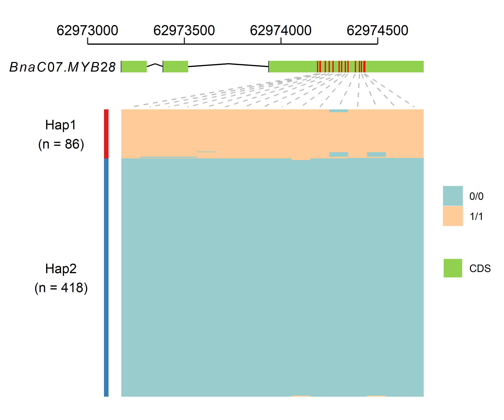
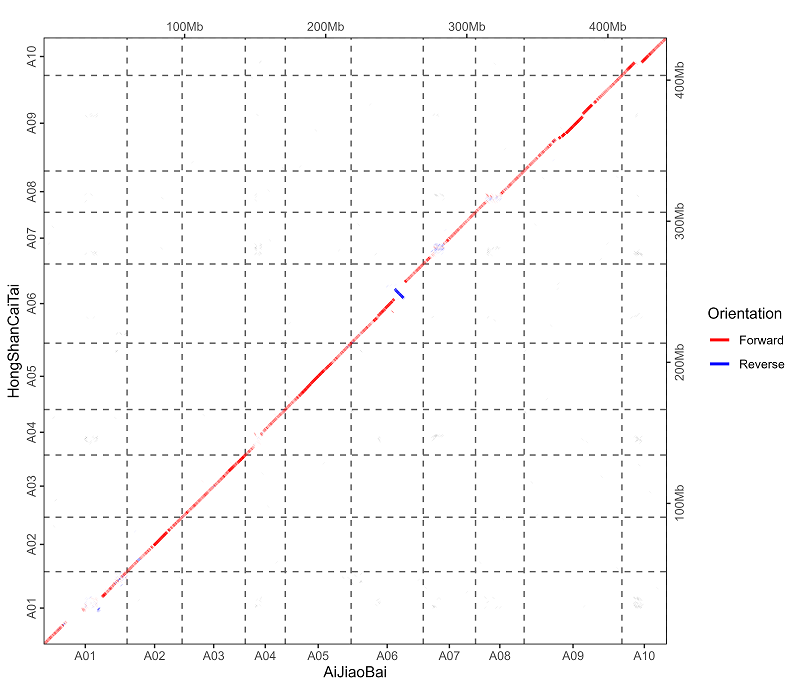
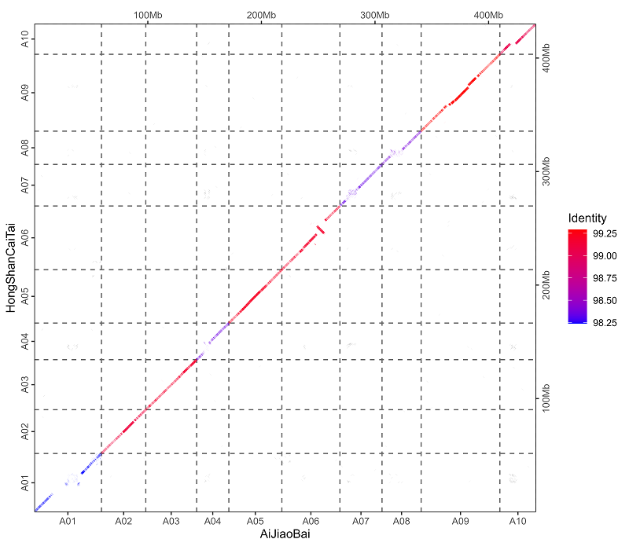
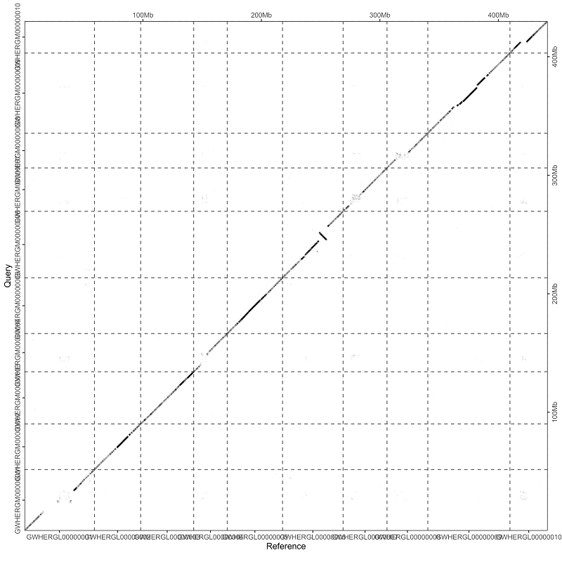
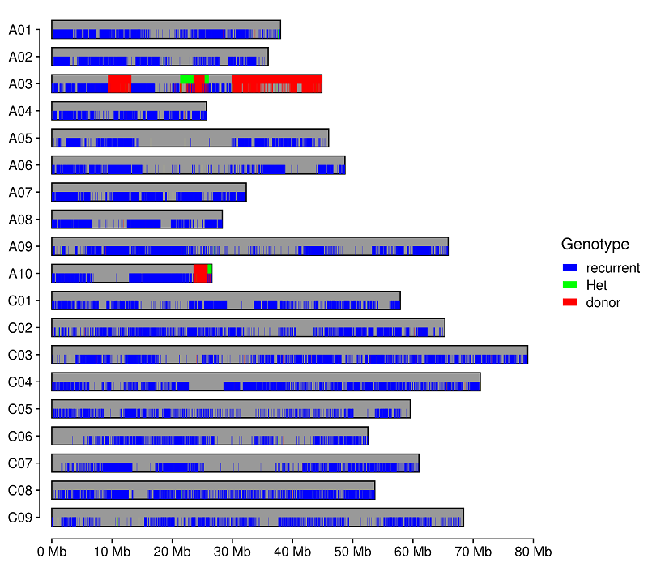

# Introduction
There are some useful scripts.

# vcf2snpbinner.R
A R script for transforming vcf file to [SNPBinner](https://github.com/solgenomics/snpbinner) input file. The heterozygosity and missing rate will be calculated for output SNP marker.
## Usage
```bash
Rscript ./vcf2snpbinner.R -h
```
```txt
usage: vcf2snpbinner.R [--] [--help] [--opts OPTS] [--input INPUT]
       [--out OUT] [--parent1 PARENT1] [--parent2 PARENT2] [--minDP_p1
       MINDP_P1] [--minDP_p2 MINDP_P2] [--max_missing MAX_MISSING]

a program for converting vcf to table of snpbinner. genotype same as
parent_1 is designated 'a', genotype same as parent_2 is designated
'b', heterozygous genotype is designated 'h', missing genotype is
designated '-'

flags:
  -h, --help         show this help message and exit

optional arguments:
  -x, --opts         RDS file containing argument values
  -i, --input        vcf or vcf.gz file containing two parents and
                     progeny lines
  -o, --out          output file prefix
  -p, --parent1      name of parent_1
  -P, --parent2      name of parent_2
  -d, --minDP_p1     Minimum depth of parent_1 [default: 5]
  -D, --minDP_p2     Minimum depth of parent_2 [default: 5]
  -m, --max_missing  Maximum missing rate of SNP [default: 0.3]

```

# Haplotype.R (GeneStructure with Variation)
A R script for drawing gene structure and the variation of this gene in a population. A gtf file containing target gene, a vcf file containing variation of this gene and phenotype data is needed. Hierarchical clustering algorithm was adopted to distinguish different haplotype, the number of haplotype can be designated according clusting result. Some polymorphism may exsit within samples belonging to the same haplotype, you can divided them into different haplotypes by setting more haplotypes.



# ePCR.pl
A perl script for ePCR. Input is tsv (tab-separated values) file containing three columns (PrimerID, forwardPrimer, Reverse Primer).

## Requiement
- [ePCR](http://ftp.debian.org/debian/pool/main/e/epcr/epcr_2.3.12-1.orig.tar.gz)

## Preparation
```bash
# lower letter to UPPER letter
seqkit seq -u reference.fa > genome.fa
# prepare sequence database for re-PCR searches
famap -t N -b genome.famap genome.fa
fahash -b genome.hash -w 12 -f 3 genome.famap
```
## Usage
```bash
perl ePCR.pl -h
```
```txt

############################################################
#
# Usage:  ePCR.pl --input primer.txt --output output.txt
#
# Required:
#
#	--input <string>			input filename, one pair primer per line, tab seperated, e.g.:
#								primerID	Left_primer_seq	Right_primer_seq
#
#	--output <string>			output filename.
#
############################################################
```

# slidingWindow.R
A sliding window function in R. The R package `tidyverse` should be installed. `values` is a vector containing column names which need be calculted.
```R
source("./slidingWindow.R")
# An example
sldWid <- slidingWindow(df = df, winSize = 1000000, winStep = 200000, groups = "CHROM", position = "POS", values = c("R.R3.depth", "R.qY.depth"), fun = "mean")
```

# addUp.R
A R function for calculating accumulation value for a column of a table. For example, a data.frame contain two columns, "chromosome" and "position", this function will calculate the accumulation position of different chromosome, then a list containing a table with a new column "position_add_Up", a vector containing breaks position, a vector containing labels, a vector containing gaps position, will be returned.
```R
source("./addUp.R")
# An example
addUp(df = df, len = len, group = "chromosome", pos = "position", band = 0.01)
addUp(df = df, len = len, group = "chromosome", pos = c("start", "end"), band = 0.01)
```

# run_DESeq2.R
A R script for differential expression analysis using DESeq2 (with biological replication). You need to prepare three files:
## Requiement
 - `read count matrix file`.
 - `samples file`, tab-delimited text file indicating biological replicate relationships.
e.g.
   ```txt
   cond_A  cond_A_rep1
   cond_A  cond_A_rep2
   cond_B  cond_B_rep1
   cond_B  cond_B_rep2
   ``` 
 - `contrasts file`, tab-delimited text file containing the pairs of sample comparisons to perform. e.g.
   ```txt
   cond_A  cond_B
   cond_Y  cond_Z
   ```
## Usage
```bash
Rscript run_DESeq2.R -h
```
```txt
usage: run_DESeq2.R [--] [--help] [--opts OPTS] [--matrix MATRIX]
       [--samples_file SAMPLES_FILE] [--min_reps MIN_REPS] [--min_cpm
       MIN_CPM] [--contrasts CONTRASTS]

Run differential expression analysis using DESeq2.

flags:
  -h, --help          show this help message and exit

optional arguments:
  -x, --opts          RDS file containing argument values
  -m, --matrix        matrix of raw read counts (not normalized!)
  -s, --samples_file  tab-delimited text file indicating biological
                      replicate relationships.
  --min_reps          At least min count of replicates must have cpm
                      values > min cpm value. [default: 2]
  --min_cpm           At least min count of replicates must have cpm
                      values > min cpm value. [default: 1]
  -c, --contrasts     file (tab-delimited) containing the pairs of
                      sample comparisons to perform.
```

# extractSeq.sh
If there is a gene/transcript id you are interested and the corresponding genomics data, 
then you want to abtain genomic, CDS, pep sequence and gene structure information of this 
gene/transcript, you can use this shll script.
## Usage
```shell
#chmod u+x extractSeq.sh
./extractSeq.sh --help
```
```txt
Usage: /home/wangpf/bin/extractSeq.sh [--genome genome_file] [--gff3 gff3_file] [--cds cds_file] [--pep pep_file] [--id gene/mRNA_id] [--up up] [--down down] [--gz]
Options:
  --genome  Specify the genome fasta file
  --gff3    Specify the gff3 file
  --cds     Specify the cds fasta file
  --pep     Specify the pep fasta file
  --id      Specify the gene/mRNA id
  --up      Specify how many bp upstream for gene/mRNA
  --down    Specify how many bp downstream for gene/mRNA
  --gz      Compress all the result if this option is present
  --help    Display this help message
```

# run_edgeR.R
A R script for differential expression analysis using edgeR (without biological replication). You need to prepare three files:
## Requiement
 - `read count matrix file`.
 - `samples file`, tab-delimited text file indicating biological replicate relationships.
e.g.
   ```txt
   cond_A  sample_A
   cond_B  sample_B
   ``` 
 - `contrasts file`, tab-delimited text file containing the pairs of sample comparisons to perform. e.g.
   ```txt
   cond_A  cond_B
   cond_Y  cond_Z
   ```
## Usage
```bash
Rscript run_edgeR.R -h
```
```txt
usage: run_edgeR.R [--] [--help] [--opts OPTS] [--matrix MATRIX]
       [--samples_file SAMPLES_FILE] [--min_reps MIN_REPS] [--min_cpm
       MIN_CPM] [--contrasts CONTRASTS] [--dispersion DISPERSION]

Run differential expression analysis using DESeq2.

flags:
  -h, --help          show this help message and exit

optional arguments:
  -x, --opts          RDS file containing argument values
  -m, --matrix        matrix of raw read counts (not normalized!)
  -s, --samples_file  tab-delimited text file indicating biological
                      replicate relationships.
  --min_reps          At least min count of replicates must have cpm
                      values > min cpm value. [default: 1]
  --min_cpm           At least min count of replicates must have cpm
                      values > min cpm value. [default: 1]
  -c, --contrasts     file (tab-delimited) containing the pairs of
                      sample comparisons to perform.
  -d, --dispersion    edgeR dispersion value. [default: 0.1]
```

# get_longest_seq.pl
In some genomics data, there are multiple isoforms fo one gene because of alternative splicing. This perl script can get the longest CDS or pep sequence of genes.

## Requiement
- perl module
  - Bio::SeqIO
- data file
  - CDS or pep sequence file
  - gff file

## Usage
```bash
perl get_longest_seq.pl -h
```
```txt

############################################################
#
# Usage:  /public/home/wangpf/bin/get_longest_seq.pl --fasta <cds_or_pep.fa> --gff <genes.gff> --out <outprefix>
#
# Required:
#
#       --fasta <string>                        CDS or pep fasta file.
#
#       --gff   <string>                        gff file.
#
#       --out   <string>                        output prefix.
#
############################################################

```
## Output
- \<outprefix\>.longest.fa, the longest CDS or pep sequence in fasta format with gene id as sequence identifier
- \<outprefix\>.longest.list, a list contain gene id, longest mRNA id and the length of longest mRNA

# find_gaps.py
There are gaps in majority genome fasta files except T2T genome. This `find_gaps.py` script will find gaps position.

## Requiement
- python3 module
  - argparse
  - Biopython
- input data
  - genome fasta file

## Usage
```bash
chmod u+x find_gaps.py
find_gaps.py -h
```
```text
usage: find_gaps.py [-h] -i INPUT -o OUTPUT [-s] [-c CONTIG]

Find gaps (N regions) in a genome FASTA file and optionally split at gaps.

optional arguments:
  -h, --help            show this help message and exit
  -i INPUT, --input INPUT
                        Input genome FASTA file
  -o OUTPUT, --output OUTPUT
                        Output file for gap positions
  -s, --split           Split the FASTA file at gaps
  -c CONTIG, --contig CONTIG
                        Output file for split contigs (default: split.fa)

```
## Output
A tab-separated text file containing three columns.
```text
<chromosome_id> <gap_start> <gap_end>
```

A fasta file with split contigs.

# mummerCoordsPlot.R
This script can draw a alignment plot according to mummer's show-coords program. 
In fact, this script is modeled after `mummerCoordsDotPlotly.R` in [dotPlotly](https://github.com/tpoorten/dotPlotly.git). `mummerCoordsDotPlotly.R` is a excellent program, but there are a few aspects that I am not entirely satisfied with:
 - It will sort query ID by length, but I want to keep query ID order in the query genome;
 - <span style="color: yellow;">Yellow</span> is not very noticeable on a white background, so I use <span style="color: red;">red</span> and <span style="color: blue;">blue</span>;
 - Add the ability to color the alignment results based on whether they are forward or reverse complementary;
 - IDs was not on the middle of chromosomes or contigs in figure;
 - I typically work with the `tidyverse` ecosystem, so I have rewritten this script using `tidyverse` syntax for clarity and consistency;
 - Some other modifications.
## Requiement
 - R package
   - argparser
   - tidyverse
 - input data
   - Alignment result from mummer's show-coords program;
     ```shell
     show-coords example.filter.delta > example.coords
     ```
   - Tab-separated text files containing reference and query IDs separately, first column is IDs in genome, the second is what you want to show in figure, only chromosomes or contigs in these files will be shown (optional). If not assigned, all IDs of chromomsomes or contigs longer than `--min-query-length` will be shown in figure, or you can just assign in the command line, e.g. "GWHERGL00000001:A01,GWHERGL00000002:A02,GWHERGL00000003:A03"
     ```text
     GWHERGL00000001	A01
     GWHERGL00000002	A02
     GWHERGL00000003	A03
     GWHERGL00000004	A04
     GWHERGL00000005	A05
     ...  ...
     ```
   - Tab-separated text files containing chromosome or contig length, first column is IDs in genome, the second is the corresponding length (optional);
     ```text
     GWHERGL00000001	59205763
     GWHERGL00000002	39005548
     GWHERGL00000003	44769757
     GWHERGL00000004	28346059
     GWHERGL00000005	46671336
     ...  ...
     ```
## Usage
```bash
Rscript mummerCoordsPlot.R -h
```

```text
usage: mummerCoordsPlot.R [--] [--help] [--opts OPTS] [--input INPUT]
       [--out OUT] [--ref REF] [--query QUERY] [--refIDs REFIDS]
       [--queryIDs QUERYIDS] [--refLen REFLEN] [--queryLen QUERYLEN]
       [--min-query-length MIN-QUERY-LENGTH] [--min-alignment-length
       MIN-ALIGNMENT-LENGTH] [--min-identity MIN-IDENTITY] [--color-by
       COLOR-BY] [--size SIZE] [--width WIDTH] [--height HEIGHT]

Generates plots of alignment data produced by show-coords.

flags:
  -h, --help                  show this help message and exit

optional arguments:
  -x, --opts                  RDS file containing argument values
  -i, --input                 coords file from mummer program
                              'show-coords'
  -o, --out                   outfile prefix
  -r, --ref                   reference name shown in plot [default:
                              Reference]
  -q, --query                 query name shown in plot [default: Query]
  -R, --refIDs                a tab-separated file containing two
                              columns, first column is IDs in reference
                              genome, second column is names to shown
                              in plot, or a string like
                              'scaffoldA01:A01,scaffoldA03:A03'. If
                              there is no file named that, we will
                              threat it as a string
  -Q, --queryIDs              a tab-separated file containing two
                              columns, first column is IDs in query
                              genome, second column is names to shown
                              in plot, or a string like
                              'scaffoldA01:A01,scaffoldA03:A03'. If
                              there is no file named that, we will
                              threat it as a string
  -l, --refLen                a tab-separated file containing two
                              columns, first column is IDs in reference
                              genome, second column is chr length
  -L, --queryLen              a tab-separated file containing two
                              columns, first column is IDs in query
                              genome, second column is chr length
  -M, --min-query-length      filter queries with total alignments less
                              than cutoff X bp [default: 4e+05]
  -m, --min-alignment-length  filter alignments less than cutoff X bp
                              [default: 2000]
  -s, --min-identity          filter alignments with identity less than
                              X % [default: 90]
  -c, --color-by              turn on color alignments by 'direction'
                              or 'identity', no color if not assign
  -S, --size                  line width of alignments in figure
  -W, --width                 plot width (inches) [default: 10]
  -H, --height                plot height (inches) [default: 10]

  ```
## Output
 - Color the alignment results based on direction.
   
 - Color the alignment results based on identity.
   
 - default.
   
## Data Source
These two genome is from this paper:
>Zhou, Yifan et al. “The complexity of structural variations in Brassica rapa revealed by assembly of two complete T2T genomes.” Science bulletin vol. 69,15 (2024): 2346-2351. doi:10.1016/j.scib.2024.03.030

# BackgroundAnalysis.R
It is important to know the length and position of introgression loci in marker-assisted selection, and this R script is used for genetic background recovery rates analysis. 
## Requiement
 - [SNPbinner](https://github.com/solgenomics/SNPbinner.git) (Python 2.7)
 - R package
   - argparser
   - tidyverse
   - cowplot
   - ggh4x
   - ggrastr (optional)
 - Tab-separated text file containing chromosome ID and labels shown in the result. (optional)
 - Tab-separated text file containing chromosome ID and length. (optional)
## Usage
```bash
Rscript BackgroundAnalysis.R -h
```
```text
usage: BackgroundAnalysis.R [--] [--help] [--opts OPTS] [--input INPUT]
       [--donor DONOR] [--recurrent RECURRENT] [--sample SAMPLE]
       [--chromosome CHROMOSOME] [--length LENGTH] [--minDdp MINDDP]
       [--maxDdp MAXDDP] [--minRdp MINRDP] [--maxRdp MAXRDP]
       [--path_to_snpbinner PATH_TO_SNPBINNER]

a program for background analysis

flags:
  -h, --help               show this help message and exit

optional arguments:
  -x, --opts               RDS file containing argument values
  -i, --input              input file name, GATK Table format
  -d, --donor              donor parent name
  -r, --recurrent          recurrent parent name
  -s, --sample             sample parent name
  -c, --chromosome         tab-separated file contain chromosome ID and
                           label shown in figure. if not assigned, all
                           chromosome in genome will be shown
  -l, --length             tab-separated file contain chromosome ID and
                           length. if not assigned, the max position of
                           SNP for each chromosome in GATK Table file
                           will be regarded as chromosome length
  -m, --minDdp             Minimum depth for donor parent [default:
                           -Inf]
  --maxDdp                 Maxmum depth for donor parent [default: Inf]
  --minRdp                 Minimum depth for recurrent parent [default:
                           -Inf]
  --maxRdp                 Maxmum depth for recurrent parent [default:
                           Inf]
  -p, --path_to_snpbinner  path to snpbinner [default:
                           ~/tools/SNPbinner-1.0.0-GondaEtAl2019/snpbinner]
```

## Output
 - a figure which show the length and position of introgression loci.
   
 - genetic background recovery rate, \<SAMPLE\>.bg_stat.csv.
   | genotype     | length(bp) | rate        |
   |--------------|------------|-------------|
   | Donor        | 23013590   | 0.023952016 |
   | Heterozygous | 3605578    | 0.003752603 |
   | Recurrent    | 934201436  | 0.972295382 |

# count_gff_length.py
Calculate the total length of a specific feature type in a GFF file, e.g. exon, gene, rRNA.

## Usage
```sh
python count_gff_length.py -h
```
```text
usage: count_gff_length.py [-h] -g GFF -c CATEGORY

Calculate total length and count of a specific feature in a GFF file.

optional arguments:
  -h, --help            show this help message and exit
  -g GFF, --gff GFF     Input GFF file
  -c CATEGORY, --category CATEGORY
                        Feature type to calculate length and count (e.g.,
                        gene, mRNA, miRNA)
```
## Input
A gff file.
