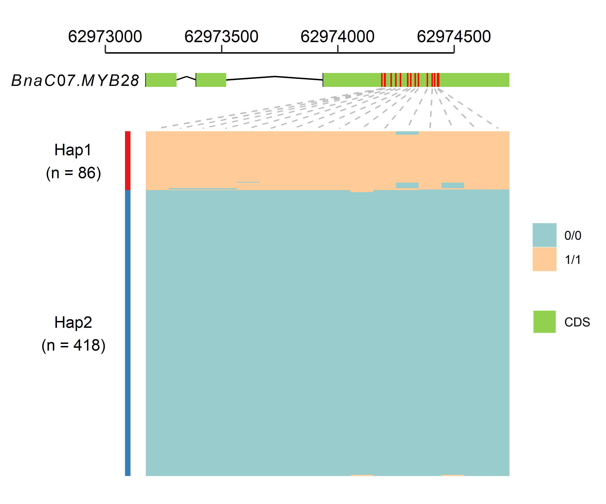

# Introduction
There are some useful scripts.

# vcf2snpbinner.R
A R script for transforming vcf file to [SNPBinner](https://github.com/solgenomics/snpbinner) input file. The heterozygosity and missing rate will be calculated for output SNP marker.
```bash
Rscript ./vcf2snpbinner.R -h
```
```txt
usage: reform.R [--] [--help] [--opts OPTS] [--input INPUT] [--out OUT]
       [--parent1 PARENT1] [--parent2 PARENT2] [--minDP_p1 MINDP_P1]
       [--minDP_p2 MINDP_P2]

a program for converting vcf to table of snpbinner. genotype same as
parent_1 is designated 'a', genotype same as parent_2 is designated
'b', heterozygous genotype is designated 'h', missing genotype is
designated '-'

flags:
  -h, --help      show this help message and exit

optional arguments:
  -x, --opts      RDS file containing argument values
  -i, --input     vcf or vcf.gz file containing two parents and progeny
                  lines
  -o, --out       output file prefix
  -p, --parent1   name of parent_1
  --parent2       name of parent_2
  -m, --minDP_p1  Minimum depth of parent_1 [default: 5]
  --minDP_p2      Minimum depth of parent_2 [default: 5]
```

# GeneStructure_with_Variation
A R script for drawing gene structure and the variation of this gene in a population. A gtf file containing target gene, a vcf file containing variation of this gene and phenotype data is needed. Hierarchical clustering algorithm was adopted to distinguish different haplotype, the number of haplotype can be designated according clusting result. Some polymorphism may exsit within samples belonging to the same haplotype, you can divided them into different haplotypes by setting more haplotypes.



# ePCR.pl
A perl script for ePCR. Input is tsv (tab-separated values) file containing three columns (PrimerID, forwardPrimer, Reverse Primer).

**Requiement**
- [ePCR](http://ftp.debian.org/debian/pool/main/e/epcr/epcr_2.3.12-1.orig.tar.gz)

**Preparation**
```bash
# lower letter to UPPER letter
seqkit seq -u reference.fa > genome.fa
# prepare sequence database for re-PCR searches
famap -t N -b genome.famap genome.fa
fahash -b genome.hash -w 12 -f 3 genome.famap
```

```bash
perl ePCR.pl -h
```
```txt

############################################################
#
# Usage:  ePCR.pl --input primer.txt --output output.txt
#
# Required:
#
#	--input <string>			input filename, one pair primer per line, tab seperated, e.g.:
#								primerID	Left_primer_seq	Right_primer_seq
#
#	--output <string>			output filename.
#
############################################################
```

# slidingWindow.R
A sliding window function in R. The R package `tidyverse` should be installed. `values` is a vector containing column names which need be calculted.
```R
source("./slidingWindow.R")
# An example
sldWid <- slidingWindow(df = df, winSize = 1000000, winStep = 200000, groups = "CHROM", position = "POS", values = c("R.R3.depth", "R.qY.depth"), fun = "mean")
```

# addUp.R
A R function for calculating accumulation value for a column of a table. For example, a data.frame contain two columns, "chromosome" and "position", this function will calculate the accumulation position of different chromosome, then a list containing a table with a new column "position_add_Up", a vector containing breaks position, a vector containing labels, a vector containing gaps position, will be returned.
```R
source("./addUp.R")
# An example
addUp(df = df, len = len, group = "chromosome", pos = "position", band = 0.01)
addUp(df = df, len = len, group = "chromosome", pos = c("start", "end"), band = 0.01)
```

# run_DESeq2.R
A R script for differential expression analysis using DESeq2 (with biological replication). You need to prepare three files:
- `read count matrix file`.
- `samples file`, tab-delimited text file indicating biological replicate relationships.
e.g.
```txt
cond_A  cond_A_rep1
cond_A  cond_A_rep2
cond_B  cond_B_rep1
cond_B  cond_B_rep2
``` 
- `contrasts file`, tab-delimited text file containing the pairs of sample comparisons to perform. e.g.
```txt
cond_A  cond_B
cond_Y  cond_Z
```
Usage:
```bash
Rscript run_DESeq2.R -h
```
```txt
usage: run_DESeq2.R [--] [--help] [--opts OPTS] [--matrix MATRIX]
       [--samples_file SAMPLES_FILE] [--min_reps MIN_REPS] [--min_cpm
       MIN_CPM] [--contrasts CONTRASTS]

Run differential expression analysis using DESeq2.

flags:
  -h, --help          show this help message and exit

optional arguments:
  -x, --opts          RDS file containing argument values
  -m, --matrix        matrix of raw read counts (not normalized!)
  -s, --samples_file  tab-delimited text file indicating biological
                      replicate relationships.
  --min_reps          At least min count of replicates must have cpm
                      values > min cpm value. [default: 2]
  --min_cpm           At least min count of replicates must have cpm
                      values > min cpm value. [default: 1]
  -c, --contrasts     file (tab-delimited) containing the pairs of
                      sample comparisons to perform.
```

# extractSeq.sh
If there is a gene/transcript id you are interested and the corresponding genomics data, 
then you want to abtain genomic, CDS, pep sequence and gene structure information of this 
gene/transcript, you can use this shll script.
Usage:
```shell
#chmod u+x extractSeq.sh
./extractSeq.sh --help
```
```txt
Usage: /home/wangpf/bin/extractSeq.sh [--genome genome_file] [--gff3 gff3_file] [--cds cds_file] [--pep pep_file] [--id gene/mRNA_id] [--up up] [--down down] [--gz]
Options:
  --genome  Specify the genome fasta file
  --gff3    Specify the gff3 file
  --cds     Specify the cds fasta file
  --pep     Specify the pep fasta file
  --id      Specify the gene/mRNA id
  --up      Specify how many bp upstream for gene/mRNA
  --down    Specify how many bp downstream for gene/mRNA
  --gz      Compress all the result if this option is present
  --help    Display this help message
```

# run_edgeR.R
A R script for differential expression analysis using edgeR (without biological replication). You need to prepare three files:
- `read count matrix file`.
- `samples file`, tab-delimited text file indicating biological replicate relationships.
e.g.
```txt
cond_A  sample_A
cond_B  sample_B
``` 
- `contrasts file`, tab-delimited text file containing the pairs of sample comparisons to perform. e.g.
```txt
cond_A  cond_B
cond_Y  cond_Z
```
Usage:
```bash
Rscript run_edgeR.R -h
```
```txt
usage: run_edgeR.R [--] [--help] [--opts OPTS] [--matrix MATRIX]
       [--samples_file SAMPLES_FILE] [--min_reps MIN_REPS] [--min_cpm
       MIN_CPM] [--contrasts CONTRASTS] [--dispersion DISPERSION]

Run differential expression analysis using DESeq2.

flags:
  -h, --help          show this help message and exit

optional arguments:
  -x, --opts          RDS file containing argument values
  -m, --matrix        matrix of raw read counts (not normalized!)
  -s, --samples_file  tab-delimited text file indicating biological
                      replicate relationships.
  --min_reps          At least min count of replicates must have cpm
                      values > min cpm value. [default: 1]
  --min_cpm           At least min count of replicates must have cpm
                      values > min cpm value. [default: 1]
  -c, --contrasts     file (tab-delimited) containing the pairs of
                      sample comparisons to perform.
  -d, --dispersion    edgeR dispersion value. [default: 0.1]
```

# get_longest_seq.pl
In some genomics data, there are multiple isoforms fo one gene because of alternative splicing. This perl script can get the longest CDS or pep sequence of genes.

**Requiement**
- perl module
  - Bio::SeqIO
- data file
  - CDS or pep sequence file
  - gff file

**Usage:**
```bash
perl get_longest_seq.pl -h
```
```txt

############################################################
#
# Usage:  /public/home/wangpf/bin/get_longest_seq.pl --fasta <cds_or_pep.fa> --gff <genes.gff> --out <outprefix>
#
# Required:
#
#       --fasta <string>                        CDS or pep fasta file.
#
#       --gff   <string>                        gff file.
#
#       --out   <string>                        output prefix.
#
############################################################

```
**Output**
- \<outprefix\>.longest.fa, the longest CDS or pep sequence in fasta format with gene id as sequence identifier
- \<outprefix\>.longest.list, a list contain gene id, longest mRNA id and the length of longest mRNA